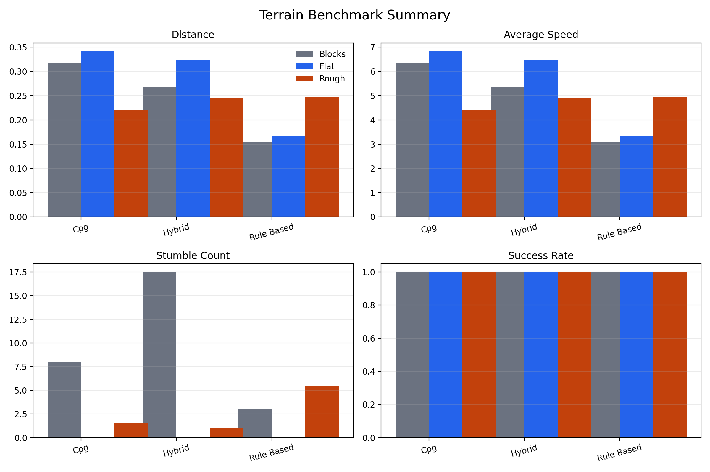
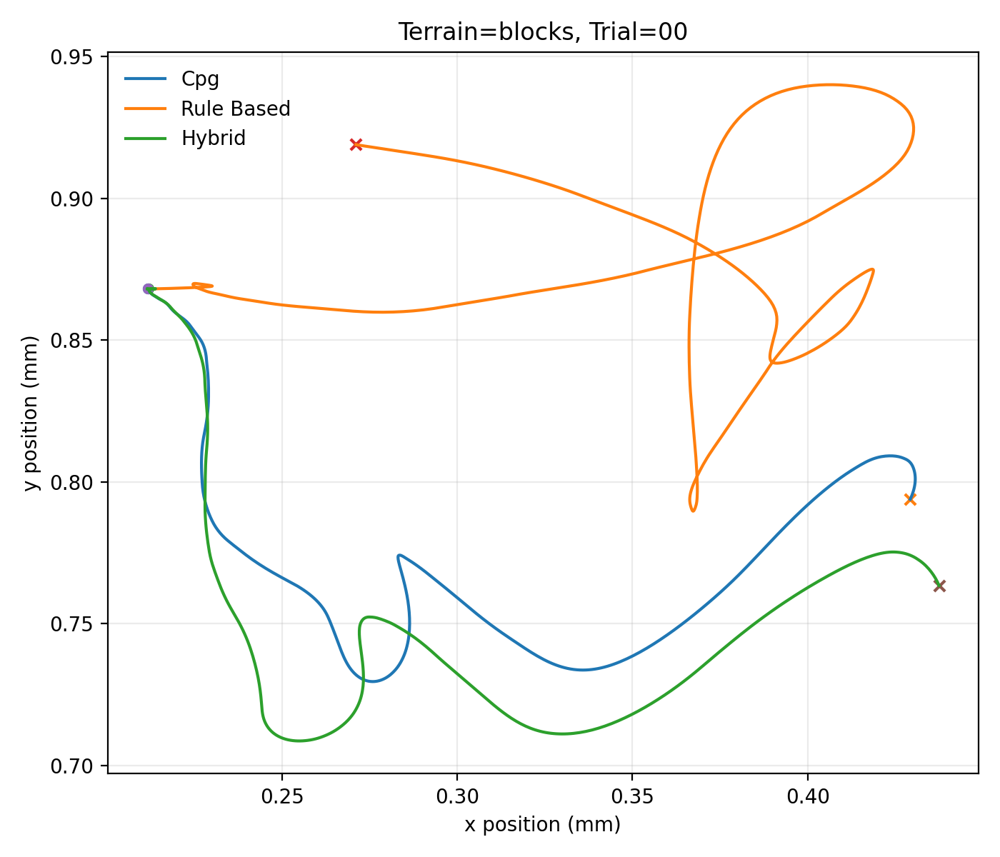
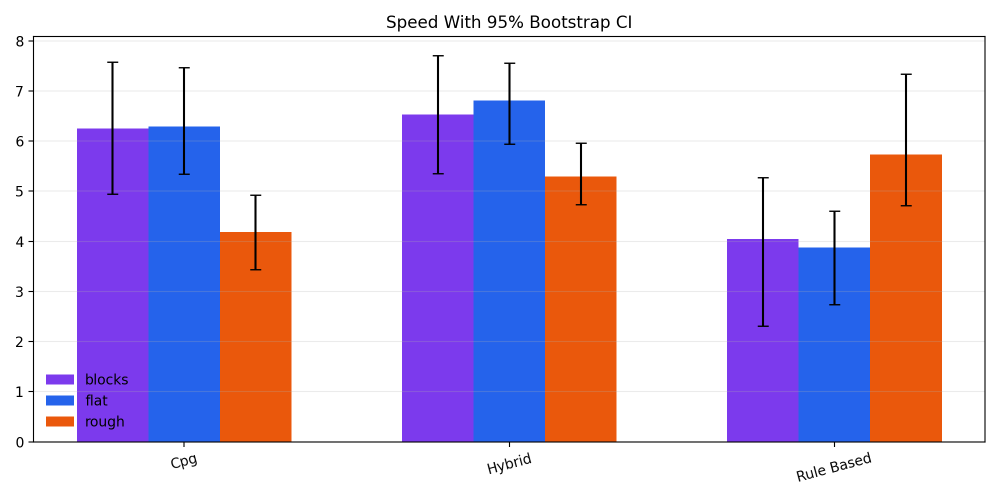
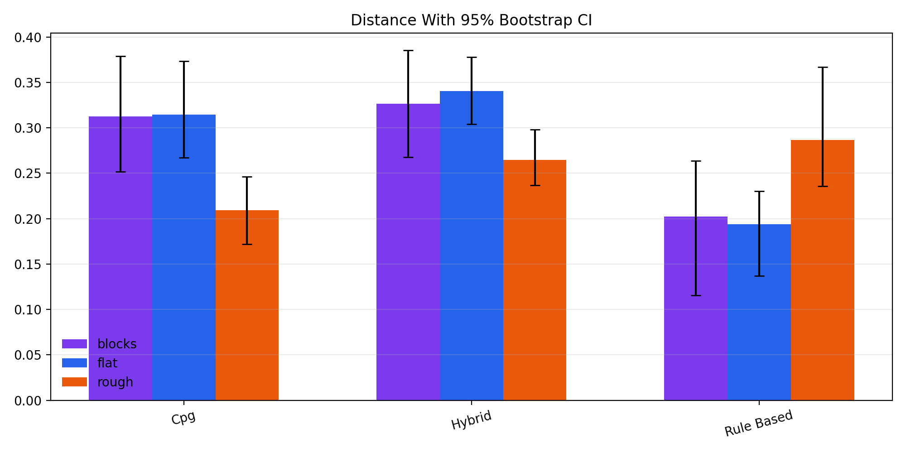
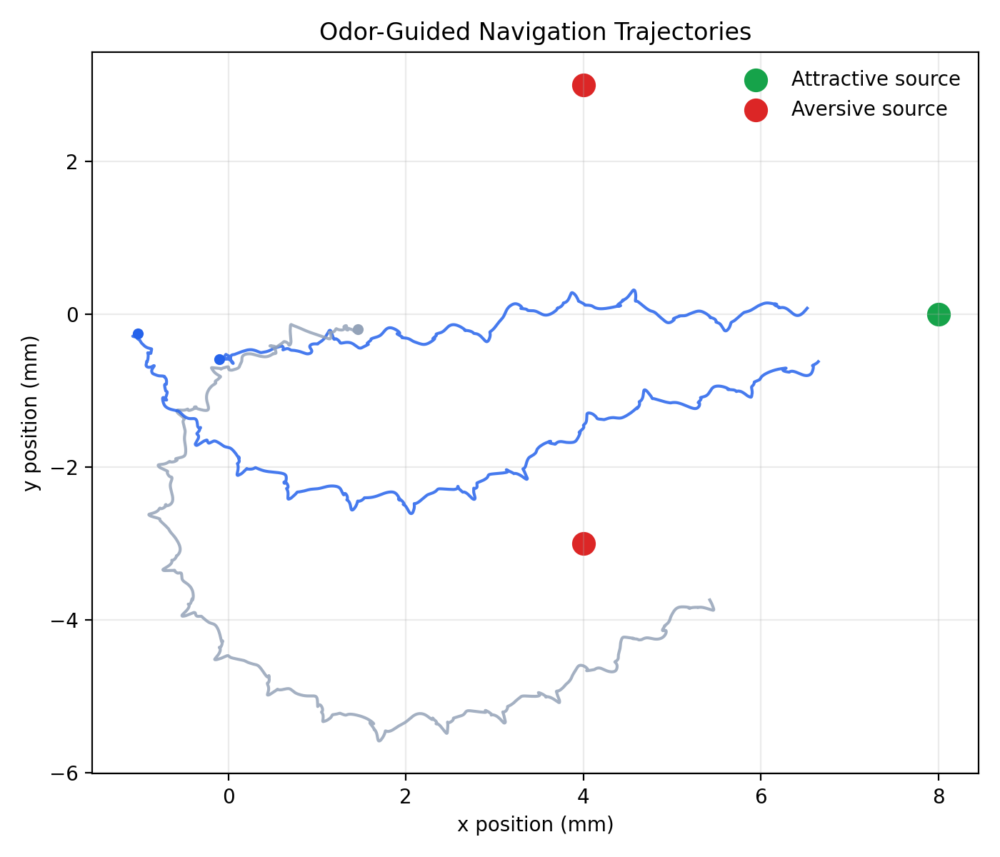
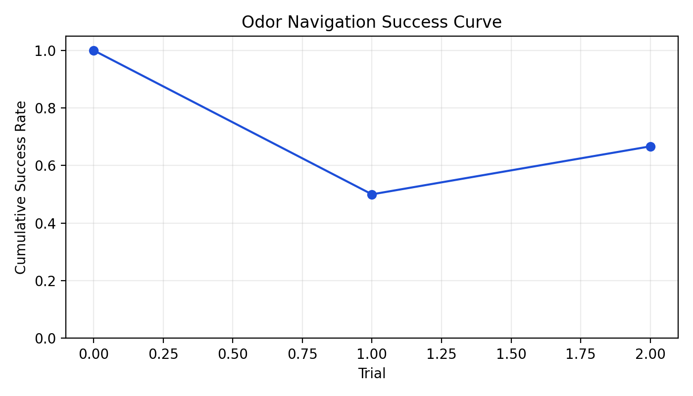
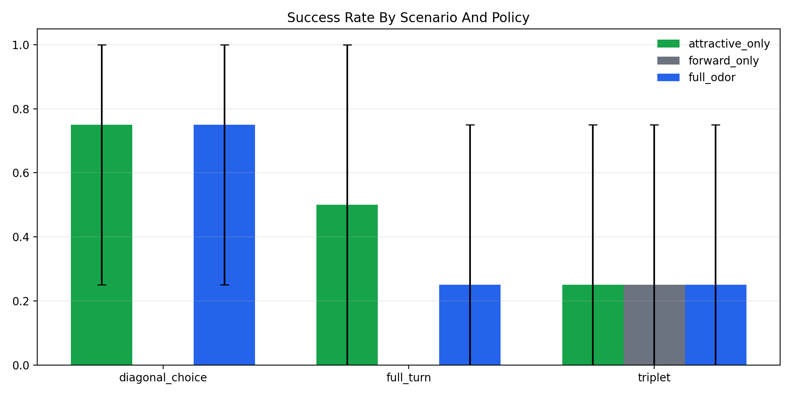
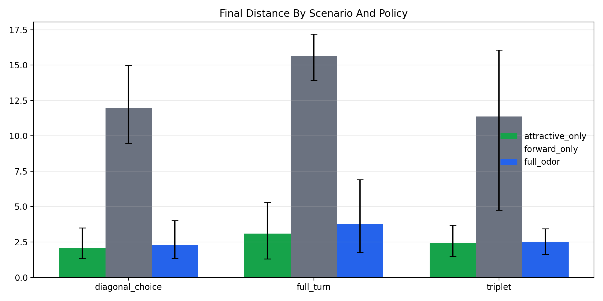
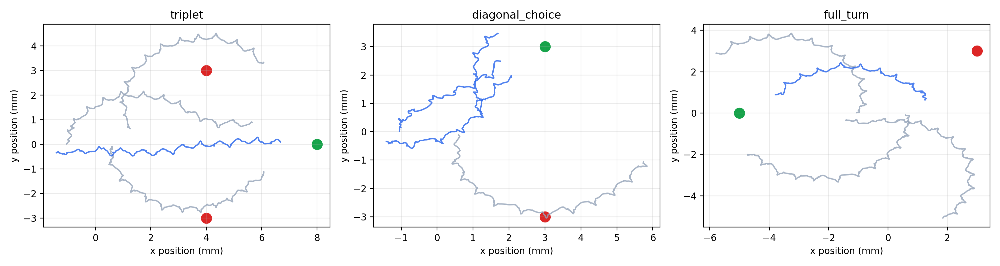

# Neurofly

Neurofly is a reproducible experiment suite built on NeuroMechFly through the legacy `flygym-gymnasium` API. It contains two small embodied computational neuroscience projects:

- **A: terrain locomotion** tests how existing fly locomotion controllers behave as terrain gets harder.
- **B: odor navigation** tests whether odor-driven steering helps a simulated fly navigate under competing sensory cues.

Both experiments are packaged as command-line benchmarks that save metrics, plots, trajectory files, markdown reports, and optional videos.

## Project Goals

Neuroscience goal:

- Study how neural-inspired gait controllers cope with increasingly difficult walking surfaces.
- Study how attractive and aversive olfactory signals shape goal-directed navigation.

Computational goal:

- Turn NeuroMechFly tutorial-style examples into reproducible benchmarks with matched trials and interpretable outputs.
- Compare controllers and policies with summary statistics, bootstrap confidence intervals, and pairwise nonparametric tests.

## Simulator Version

This project uses FlyGym 1.x through `flygym-gymnasium`.

| Component | Version / role |
| --- | --- |
| Python | `>=3.11,<3.13` |
| Package manager | `uv` |
| Simulation library | `flygym-gymnasium[examples]>=1.3.2,<2.0.0` |
| Recorded local run version | `flygym_gymnasium_version=1.3.2` |
| API generation | Legacy FlyGym 1.x / `flygym-gymnasium` API |

FlyGym 1.x is used here because it has the mature locomotion and olfaction example surface needed for these benchmarks.

## Setup

```bash
git clone <repo-url>
cd neurofly
uv sync
uv run neurofly-env-check
uv run neurofly-odor-env-check
```

The project is pinned away from Python 3.14 because the current FlyGym stack does not support it.

## Repository Layout

```text
configs/
  terrain_benchmark.toml
  odor_navigation.toml
docs/
  terrain-benchmark-plan.md
  odor-navigation-plan.md
media/
  images/
  videos/
scripts/
  reproduce_a.sh
  reproduce_b.sh
  reproduce_all.sh
  smoke.sh
src/
  neurofly/
  neurofly_odor/
tests/
  test_terrain_outputs.py
  test_navigation_outputs.py
```

Generated experiment outputs go under `outputs/`. That folder is ignored by Git so local runs do not bloat the repository. Curated blog media lives under `media/`.

## Experiment A: Terrain Locomotion

A compares three controller styles:

- `cpg`
- `rule_based`
- `hybrid`

across:

- `flat`
- `rough`
- `blocks`

Fast smoke run:

```bash
uv run neurofly-terrain-benchmark --terrain flat --controller cpg --duration-s 0.02 --trials 1 --no-render --no-save-video
```

Showcase metric sweep:

```bash
uv run neurofly-terrain-benchmark --output-dir outputs/terrain_try --trials 2 --duration-s 0.05 --no-render --no-save-video
```

Research sweep:

```bash
uv run neurofly-terrain-research --output-dir outputs/terrain_research_try --trials 4 --duration-s 0.05
```

Or run both:

```bash
scripts/reproduce_a.sh
```

Main outputs:

- `outputs/terrain_try/results.csv`
- `outputs/terrain_try/SHOWCASE_REPORT.md`
- `outputs/terrain_research_try/RESEARCH_REPORT.md`
- `outputs/terrain_research_try/summary_with_ci.csv`
- `outputs/terrain_research_try/pairwise_stats.csv`

## Experiment B: Odor Navigation

B compares three navigation policies:

- `full_odor`
- `attractive_only`
- `forward_only`

across multiple odor layouts:

- `triplet`
- `diagonal_choice`
- `full_turn`

Fast smoke run:

```bash
uv run neurofly-odor-benchmark --trials 1 --run-time 1.0 --no-render --no-save-video
```

Showcase metric sweep:

```bash
uv run neurofly-odor-benchmark --output-dir outputs/odor_try --trials 3 --run-time 1.5 --no-render --no-save-video
```

Research sweep:

```bash
uv run neurofly-odor-research --output-dir outputs/odor_research_try --trials 4 --run-time 1.0
```

Or run both:

```bash
scripts/reproduce_b.sh
```

Main outputs:

- `outputs/odor_try/results.csv`
- `outputs/odor_try/SHOWCASE_REPORT.md`
- `outputs/odor_research_try/RESEARCH_REPORT.md`
- `outputs/odor_research_try/summary_with_ci.csv`
- `outputs/odor_research_try/pairwise_stats.csv`

## Media Preview

The repository includes curated figures and short videos from the terrain and odor experiments. Images render directly on the GitHub README page; videos are linked as repository media files.

### A: Terrain Locomotion Figures









### B: Odor Navigation Figures











### Videos

- [A1: Terrain locomotion montage](media/videos/a1-terrain-locomotion-montage.mp4)
- [A2: Hybrid controller on block terrain](media/videos/a2-terrain-hybrid-blocks.mp4)
- [B1: Odor navigation run](media/videos/b1-odor-navigation-run.mp4)
- [B2: Longer odor navigation trial](media/videos/b2-odor-navigation-hard-trial.mp4)

The source assets live under `media/images/` and `media/videos/`.

## Verification

Run the local smoke script:

```bash
scripts/smoke.sh
```

Or run the checks directly:

```bash
uv run ruff check .
uv run pytest
```

## Citation

If you use this repository, cite this project using `CITATION.cff` and also cite the upstream NeuroMechFly/FlyGym papers listed there.

## License

This project is released under the MIT License. See `LICENSE`.
